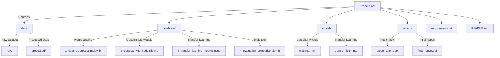

# <div align="center">**Yelp Review Classification**</div>

<div align="center">
  
</div>

---

## <div align="center">Project Overview</div>

This project aims to classify Yelp customer reviews into **sentiment categories** (e.g., positive/negative). It compares **classical machine learning algorithms** with **transfer learning models** (e.g., RoBERTa, XLNet) to determine the best approach for sentiment classification. The goal is to evaluate the performance of different models and identify the most effective method for classifying Yelp reviews.

---

## <div align="center">Features</div>

- **Data Preprocessing**: Cleaning and preparing textual data, including tokenization, stop-word removal, and lemmatization.
- **Classical ML Models**: Implementing Logistic Regression and Random Forest for baseline performance.
- **Transfer Learning Models**: Fine-tuning RoBERTa and XLNet for advanced text classification.
- **Evaluation**: Comparing models using metrics like accuracy, precision, recall, and F1-score.
- **Visualization**: Displaying results with confusion matrices, ROC curves, and performance charts for better interpretation.

---

## <div align="center">Project Structure</div>



---

## <div align="center">How to Run the Project</div>

1. **Clone the Repository**
   ```bash
   git clone https://github.com/yassinebenacha/Customer-Reviews-Classification.git
   cd Customer-Reviews-Classification
   ```

2. **Install Dependencies**
   ```bash
   pip install -r requirements.txt
   ```

3. **Download the Dataset**
   - Visit the [Yelp Open Dataset](https://www.yelp.com/dataset).
   - Download the dataset and place it in the `data/raw/` directory.

4. **Run Notebooks Step-by-Step**
   - **Step 1**: Preprocess data in `1_data_preprocessing.ipynb`.
   - **Step 2**: Train classical ML models in `2_classical_ML_models.ipynb`.
   - **Step 3**: Fine-tune transfer learning models in `3_transfer_learning_models.ipynb`.
   - **Step 4**: Evaluate and compare results in `4_evaluation_comparison.ipynb`.

---

## <div align="center">Results</div>

### Evaluation Metrics:
- **Accuracy**: Overall correctness of the model.
- **Precision**: Proportion of true positive predictions.
- **Recall**: Ability to find all relevant instances.
- **F1-Score**: Balance between precision and recall.

### Example Performance:

| Model                | Accuracy | Precision | Recall | F1-Score |
|----------------------|----------|-----------|--------|----------|
| Logistic Regression  | 84.0%    | 81.0%     | 78.0%  | 79.0%    |
| SVM                  | 91.0%    | 90.0%     | 88.0%  | 89.0%    |
| RoBERTa              | 85.0%    | 84.0%     | 83.0%  | 83.0%    |
| XLNet                | 84.0%    | 83.0%     | 82.0%  | 82.0%    |

---

## <div align="center">Technologies Used</div>

<div align="center">
  
  
  
  
</div>

### Libraries:
- **Data Handling**: Pandas, NumPy
- **Text Preprocessing**: NLTK, SpaCy
- **Classical ML**: Scikit-learn
- **Transfer Learning**: HuggingFace Transformers, PyTorch
- **Visualization**: Matplotlib, Seaborn

---

## <div align="center">License</div>

This project is licensed under the MIT License. Feel free to contribute, modify, and use for educational purposes.
